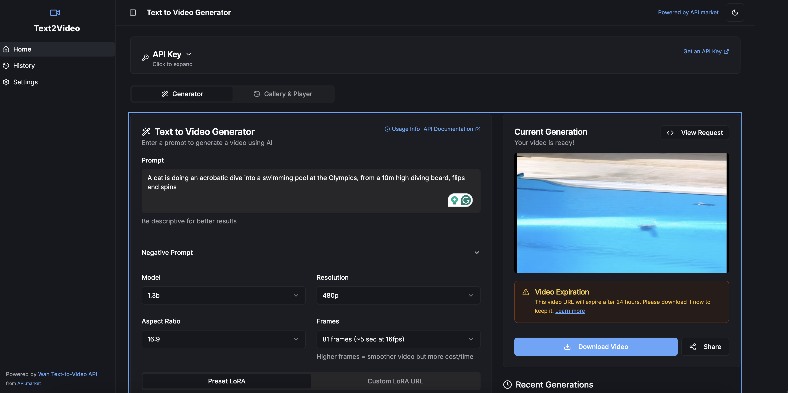

# 🎬 Text to Video Generator



A modern web application that allows users to generate videos from text prompts using AI technology, powered by [API.market](https://api.market)'s Wan Text-to-Image API.

## 📋 Table of Contents

- [🌟 Overview](#-overview)
- [✨ Features](#-features)
- [🚀 Getting Started](#-getting-started)
  - [📋 Prerequisites](#-prerequisites)
  - [🛠️ Installation](#️-installation)
- [🔑 Getting an API Key](#-getting-an-api-key)
- [📖 Usage](#-usage)
  - [💻 Running Locally](#-running-locally)
  - [🏗️ Building for Production](#️-building-for-production)
- [📡 API Information](#-api-information)
  - [🔌 Endpoints](#-endpoints)
  - [⚙️ Request Parameters](#️-request-parameters)
  - [📮 Request Format](#-request-format)
  - [📨 Response Structure](#-response-structure)
  - [🎭 Available LoRA Models](#-available-lora-models)
- [👥 Contributing](#-contributing)
  - [📜 Code of Conduct](#-code-of-conduct)
  - [🤝 How to Contribute](#-how-to-contribute)
  - [🔄 Development Workflow](#-development-workflow)
  - [🔍 Pull Request Process](#-pull-request-process)
  - [📏 Coding Standards](#-coding-standards)
  - [👪 Community](#-community)
- [📄 License](#-license)
- [🙏 Acknowledgments](#-acknowledgments)
- [🔐 Privacy & Data Retention](#-privacy--data-retention)

## 🌟 Overview

This project is a Next.js application that provides a user-friendly interface for generating videos from text prompts using AI technology. It leverages the Wan Text-to-Image API from API.market to create frame-by-frame animations based on user-provided prompts and settings.

**No database or additional backend services are required!** 💯 The application runs entirely in the browser, storing all data locally in localStorage. It only makes API calls to API.market for the actual video generation.

## ✨ Features

- 🪄 Text-to-video generation with customizable parameters
- 🤖 Selection between different AI models (1.3b for speed, 14b for quality)
- 📐 Adjustable resolution and aspect ratio settings
- 🎞️ Customizable frame settings for smoother videos
- 🎨 Support for custom LoRA models and styles
- ❌ Negative prompt support for better control
- 🖼️ History gallery for viewing and managing past generations
- 📱 Video player with download and share functionality
- 🌓 Dark/Light mode support
- 📊 Responsive design that works across devices
- 🔒 Client-side storage of API keys and generation history
- ⏱️ 24-hour video URL expiration with download options
- 🚫 Zero backend dependencies - runs entirely in the browser

## 🚀 Getting Started

### 📋 Prerequisites

- [Node.js](https://nodejs.org/) (v18 or higher)
- [npm](https://www.npmjs.com/) (v7 or higher) or [yarn](https://yarnpkg.com/) (v1.22 or higher)
- [Git](https://git-scm.com/)
- An API key from [API.market](https://api.market/store/magicapi/wan-text-to-image)

### 🛠️ Installation

1. Clone the repository:

```bash
git clone https://github.com/Noveum/wan-text-to-video-app.git
cd wan-text-to-video-app
```

2. Install dependencies:

```bash
npm install
# or
yarn install
```

## 🔑 Getting an API Key

To use this application, you'll need an API key from API.market:

1. Visit [API.market](https://api.market/store/magicapi/wan-text-to-image)
2. Create an account or log in
3. Subscribe to the Wan Text-to-Image API
4. Copy your API key
5. Paste it into the API Key field in the application

The free tier includes 100 API units, with pay-as-you-go pricing afterward. 💸

## 📖 Usage

### 💻 Running Locally

To start the development server:

```bash
npm run dev
# or
yarn dev
```

Then open [http://localhost:3000](http://localhost:3000) in your browser.

### 🏗️ Building for Production

To create a production build:

```bash
npm run build
# or
yarn build
```

To start the production server:

```bash
npm run start
# or
yarn start
```

## 📡 API Information

### 🔌 Endpoints

The application uses the following API endpoints from API.market:

- `POST /api/v1/magicapi/wan-text-to-image/text-to-video/run` - Generate videos from text
- `GET /api/v1/magicapi/wan-text-to-image/text-to-video/status/{id}` - Check the status of a text-to-video generation
- `POST /api/v1/magicapi/wan-text-to-image/image-to-video/run` - Generate videos from an image + text
- `GET /api/v1/magicapi/wan-text-to-image/image-to-video/status/{id}` - Check the status of an image-to-video generation

### ⚙️ Request Parameters

#### 📝 Text-to-Video Parameters

| Parameter | Description | Valid Values | Default | Notes |
|-----------|-------------|--------------|---------|-------|
| prompt | Main textual description of the desired video | string | (required) | E.g. "Elephants flying in sky in a group" |
| negative_prompt | Concepts or items to exclude from the video | string | "" | E.g. "no text overlays" |
| aspect_ratio | Desired aspect ratio for the output video | "16:9", "9:16", "1:1" | "16:9" | Choose based on your output platform |
| frames | Number of frames to generate | 17, 33, 49, 65, 81 | 81 | Higher frames = smoother video but more cost/time |
| model | Model size | "1.3b", "14b" | "14b" | 1.3b is faster, 14b yields higher quality |
| lora_url | URL of a LoRA checkpoint for style or domain adaptation | string (URL) or null | null | Optional parameter |
| resolution | Video resolution | "480p", "720p" | "480p" | 720p only available with 14b model |
| sample_steps | Number of generation steps | integer (1-60) | 30 | More steps increase quality but slow down processing |

### 📮 Request Format

```json
{
  "input": {
    "prompt": "Elephants flying in sky in a group",
    "negative_prompt": "low quality, distorted, ugly",
    "model": "1.3b",
    "resolution": "480p",
    "aspect_ratio": "16:9",
    "frames": 81,
    "sample_steps": 30,
    "sample_shift": 8,
    "sample_guide_scale": 5,
    "lora_url": "https://huggingface.co/motimalu/wan-flat-color-v2/resolve/main/wan_flat_color_v2.safetensors",
    "lora_strength_clip": 1,
    "lora_strength_model": 1
  }
}
```

### 📨 Response Structure

Initial response when submitting a job:

```json
{
  "id": "e8a0f6f0-89bc-4dea-829b-a62b0e5a461f-u2",
  "status": "IN_QUEUE"
}
```

Response when checking job status (completed):

```json
{
  "delayTime": 1118,
  "executionTime": 1398169,
  "id": "e8a0f6f0-89bc-4dea-829b-a62b0e5a461f-u2",
  "output": {
    "completed_at": "2025-03-18T16:52:30.048710+00:00",
    "input": {
      "aspect_ratio": "16:9",
      "frames": 81,
      "prompt": "Elephants flying in sky in a group",
      "..." : "..."
    },
    "metrics": {
      "predict_time": 1397.867959
    },
    "output": [
      "https://somevideo.cloudfront.net/wan_text_videos/video.mp4"
    ],
    "status": "succeeded"
  },
  "status": "COMPLETED",
  "workerId": "iiqyolie8t7vts"
}
```

### 🎭 Available LoRA Models

The API provides several pre-configured LoRA models for different styles and effects:

| LoRA Name | Description |
|-----------|-------------|
| Wan Flat Color v2 | Flat color style with vibrant colors and simplified forms |
| 360 Effect | Creates a 360-degree spinning or panoramic effect |
| Flying Effect | Adds movement suggesting flight or floating in air |
| Zen Style | Adds elements suggesting tranquility and meditation |
| Painting Style | Transforms videos to have a hand-painted artistic quality |
| Baby Style | Transforms subjects to have more baby-like features |

To use a LoRA model, include its URL in the `lora_url` parameter of your request. The full list of available LoRAs can be found in the [API documentation](https://api.market/store/magicapi/wan-text-to-image).

## 👥 Contributing

We love contributions from the community! Whether it's fixing bugs, improving documentation, or adding new features, your help is welcome. 🙌

### 📜 Code of Conduct

This project adheres to a [Code of Conduct](CODE_OF_CONDUCT.md) that all contributors are expected to follow. Please read it before participating in this project.

### 🤝 How to Contribute

There are many ways to contribute to this project:

1. **Report bugs**: 🐛 If you find a bug, please create an issue with detailed information on how to reproduce it
2. **Suggest enhancements**: 💡 Have ideas on how to improve the project? Open an issue with the enhancement tag
3. **Improve documentation**: 📚 Documentation improvements are always welcome
4. **Submit pull requests**: 🛠️ Fix bugs or add features by submitting pull requests

To contribute code:

1. Fork the repository
2. Create a feature branch: `git checkout -b feature/amazing-feature`
3. Commit your changes: `git commit -m 'Add amazing feature'`
4. Push to the branch: `git push origin feature/amazing-feature`
5. Open a Pull Request

### 🔄 Development Workflow

1. Find or create an issue to work on
2. Comment on the issue to let others know you're working on it
3. Create a branch with a descriptive name (feature/..., bugfix/..., docs/..., etc.)
4. Implement your changes
5. Write or update tests as needed
6. Ensure all tests pass
7. Keep your commits small, focused, and with clear messages
8. Submit a pull request referencing the issue

### 🔍 Pull Request Process

1. Ensure your PR addresses a specific issue or has been discussed with maintainers
2. Update the README.md and documentation with details of changes if needed
3. Add appropriate tests for your changes
4. Ensure your code follows the project's coding standards and passes all tests
5. Your PR will be reviewed by at least one maintainer
6. Address any feedback from code reviews
7. Once approved, a maintainer will merge your PR

### 📏 Coding Standards

- Use TypeScript for type safety
- Follow the existing code style and architecture
- Use the [Airbnb JavaScript Style Guide](https://github.com/airbnb/javascript) as a general reference
- Maintain responsive design principles
- Write descriptive commit messages (following [Conventional Commits](https://www.conventionalcommits.org/) is a plus)
- Document new features and API changes
- Add comments for complex logic, but prefer self-explanatory code

### 👪 Community

- **Discord**: 💬 Join our [Discord server](https://discord.gg/noveum) for real-time discussions
- **GitHub Discussions**: 🗣️ For longer-form conversations about the project
- **Twitter**: 🐦 Follow us [@NoveumAI](https://twitter.com/NoveumAI) for updates

Your contributions help make this project better for everyone. Thank you for being part of our community! ❤️

## 📄 License

This project is licensed under the MIT License - see the [LICENSE](LICENSE) file for details.

## 🙏 Acknowledgments

- [API.market](https://api.market) for providing the Wan Text-to-Image API
- [Noveum.ai](https://noveum.ai) for their optimizations and customizations to the WAN2.1 model
- [Next.js](https://nextjs.org/) for the React framework
- [Tailwind CSS](https://tailwindcss.com/) for styling
- [Radix UI](https://www.radix-ui.com/) for accessible UI components
- All contributors who have helped improve this project

## 🔐 Privacy & Data Retention

- **No server dependencies**: 🏠 This application runs entirely in the browser without requiring a database or backend infrastructure
- 🔒 API keys are stored only in the browser's localStorage and are never sent to our servers
- 📊 Video generation history is stored locally in the browser
- ⏱️ Video URLs from API.market expire after 24 hours for security
- 🗑️ API.market deletes all requests 30 minutes after submission
- 💾 Videos are cached on API.market's CDN for 24 hours, after which all data is permanently deleted
- 🛡️ For enhanced security in production environments:
  - Consider implementing server-side API key handling
  - Use environment variables for sensitive information
  - Implement proper authentication if deploying for multiple users
  - Consider the licensing option from API.market to run the model privately in your own account for 100% data privacy 